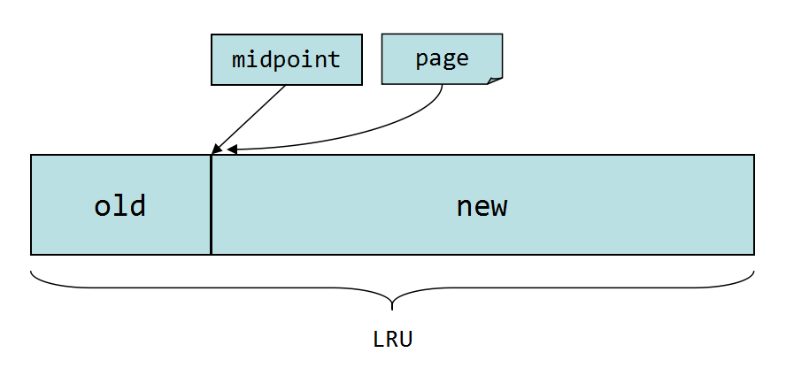

<!--
author: jockchou
date: 2015-07-23
title: InnoDB内存管理
tags: InnoDB,MySQL,内存管理
category: MySQL数据库
status: publish
summary: InnoDB缓冲池是通过LRU算法来管理page的。频繁使用的page放在LRU列表的前端，最少使用的page在LRU列表的尾端，缓冲池满了的时候，优先淘汰尾端的page。
-->

InnoDB缓冲池是通过LRU算法来管理page的。频繁使用的page放在LRU列表的前端，最少使用的page在LRU列表的尾端，缓冲池满了的时候，优先淘汰尾端的page。

## InnoDB中的LRU结构 ##

InnoDB引擎中page的默认大小为16KB，InnoDB对传统的LRU算法做了一些优化。如下图所示：



LRU列表被分成两部分，midpoint点之前的部分称为new列表，之后的部分称为old列表，new列表中的页都是最为活跌的热点数据。midpoint的位置通过参数`innodb_old_blocks_pct`来设置。

参数`innodb_old_blocks_pct`默认值为37，表示新读取的page将被插入到LRU列表左侧的37%（差不多3/8的位置）。
```
mysql> show variables like 'innodb_old_blocks%';
+------------------------+-------+
| Variable_name          | Value |
+------------------------+-------+
| innodb_old_blocks_pct  | 37    |
| innodb_old_blocks_time | 0     |
+------------------------+-------+
```

## 为什么不采用传统的LRU算法？ ##

若直接将读取到的page放到LRU的首部，那么某些SQL操作可能会使缓冲池中的page被刷出。常见的这类操作为索引或数据的扫描操作。这类操作访问表中的许多页，而这些页通常只是在这次查询中需要，并不是活跃数据。如果放入到LRU首部，那么非常可能将真正的热点数据从LRU列表中移除，在下一次需要时，InnoDB需要重新访问磁盘读取，这样性能会低下。

同时，InnoDB进一步引入了另一个参数来管理LRU列表，这个参数就是`innodb_old_blocks_time`，用于表示page放到midpoint位置后需要等待多久才会被加入到LRU列表的new端成为热点数据。

## LRU中page的变化 ##

数据库启动时，LRU列表是空的，即没有任何page，这时page都存放在Free列表中。当需要从缓冲池中分页时，首先从Free列表中查找是否有可用的空闲页，若有则将page从Free中删除，放入到LRU中。否则，根据LRU算法，淘汰LRU列表末尾的页分配给新的页。

当页从old部分进入到new部分时，此时发生的操作为page made young。因为`innodb_old_blocks_time`参数导致page没有从old移动到new部分称为page not made young。可以通过命令`show engine innodb status`来观察LRU列表及Free列表的状态。

```
----------------------
BUFFER POOL AND MEMORY
----------------------
Total memory allocated 4395630592; in additional pool allocated 0
Dictionary memory allocated 28892957
Buffer pool size   262143
Free buffers       0
Database pages     258559
Old database pages 95424
Modified db pages  36012
Pending reads 0
Pending writes: LRU 0, flush list 0, single page 0
Pages made young 72342127, not young 0
8.82 youngs/s, 0.00 non-youngs/s
Pages read 72300801, created 339791, written 13639066
8.56 reads/s, 0.35 creates/s, 3.79 writes/s
Buffer pool hit rate 1000 / 1000, young-making rate 0 / 1000 not 0 / 1000
Pages read ahead 0.00/s, evicted without access 0.00/s, Random read ahead 0.00/s
LRU len: 258559, unzip_LRU len: 0
I/O sum[459]:cur[1], unzip sum[0]:cur[0]
```

- Buffer pool size表示缓冲池共有262143个page，即262143 * 16K，约为4GB
- Free buffers表示当前Free列表中page的数量
- Database pages表示LRU列表中page的数量
- Old database pages表示LRU列表中old部分的page数量
- Modified db pages表示的是脏页(dirty page)的数量
- Pages made young表示LRU列表中page移动到new部分的次数
- youngs/s, non-youngs/s表示每秒这两种操作的次数
- Buffer pool hit rate表示缓冲池的命中率，该值若小于95%，需要观察是否全表扫描引起LRU污染
- LRU len表示LRU中总page数量

可以看到Free buffers与Database pages的和不等于Buffer pool size，这是因为缓冲池中的页还会被分配给自适应哈希索引，Lock信息，Insert Buffer等页，这部分页不需要LRU算法维护。

## 脏页(dirty page) ##

LRU列表中的page被修改后，称该页为脏页，即缓冲池中的页和磁盘上的页的数据产生了不一致。这时InnoDB通过Checkpoint机制将脏页刷新回磁盘。而Flush列表中的页即为脏页列表。脏页既存在于LRU列表中，又存在于Flush列表中，二者互不影响。Modified db pages显示的就是脏页的数量。


## 重做日志缓冲 ##

InnoDB引擎首先将重做日志信息先放到重做日志缓冲区(redo log buffer)，然后按一定频率刷新到重做日志文件。重做日志缓冲不需要设置很大，一般每一秒都会刷新redo log buffer，配置的大小只需要保证每秒产生的事务在这个缓冲区大小之内即可。通过参数`innodb_log_buffer_size`为设置：

```
mysql> show variables like 'innodb_log_buffer%';
+------------------------+----------+
| Variable_name          | Value    |
+------------------------+----------+
| innodb_log_buffer_size | 16777216 |
+------------------------+----------+
```

在下列情况下会将重做日志缓冲中的内容刷新到磁盘重做日志文件中：

- Master Thread每一秒中刷新一次
- 每个事务提交时会刷新
- 当重做日志缓冲区空间小于1/2时

## 额外内存池 ##


额外的内存池用来对一些数据结构本身的内存进行分配，例如缓冲控制对象(buffer control block)记录的LRU，锁，等待等信息。额外的内存池不够时会从缓冲池中进行申请。因此，在申请了很大的InnoDB缓冲池时，额外的内存池也要适当的调大。通过参数`innodb_additional_mem_pool_size`来设置大小。查看通过如下命令：

```
mysql> show variables like '%pool_size';
+---------------------------------+------------+
| Variable_name                   | Value      |
+---------------------------------+------------+
| innodb_additional_mem_pool_size | 67108864   |
| innodb_buffer_pool_size         | 4294967296 |
+---------------------------------+------------+
```


