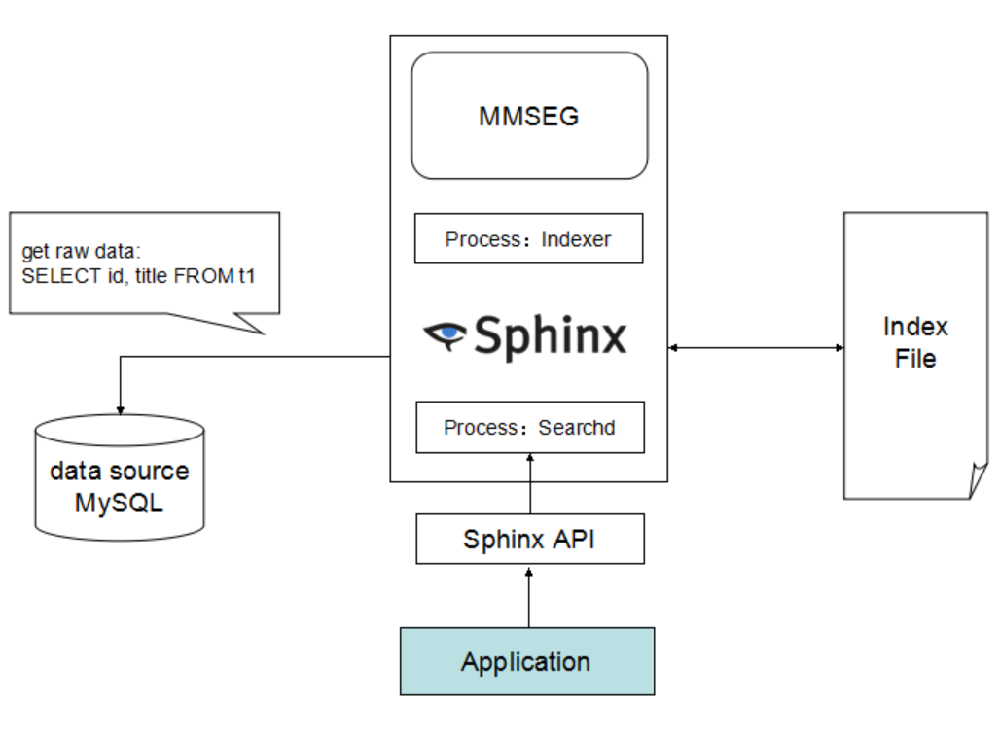

<!--
author: jockchou
date: 2015-08-24
title: coreseek原理及配置
tags: coreseek, Sphinx，搜索引擎
category: Sphinx
status: publish
summary: coreseek是一个搜索引擎框架，它可以基于MySQL数据源和mmseg分词构建全文索引，实现高性能的全文搜索服务，本文介绍coreseek的构架原理和MySQL数据源的配置。
-->

coreseek是一个搜索引擎框架，它可以基于MySQL数据源和mmseg分词构建全文索引，实现高性能的全文搜索服务，本文介绍coreseek的构架原理和MySQL数据源的配置。

## coreseek构架原理 ##

coreseek基于Sphinx研发，构架如下图所示：



构成coreseek的核心组件：

- 数据源DataSource
- mmseg分词库
- 索引构造器indexer
- 搜索服务进程searchd
- 搜索API

索引构造器indexer从数据源获取原始数据，通过mmseg分词库分词处理，构建全文索引文件。搜索服务进程searchd提供搜索API，负责处理客户端连接，接收客户端搜索请求，查询索引文件数据。

## MySQL数据源的配置 ##

coreseek默认配置文件为:
```
/usr/local/coreseek/etc/csft.conf
```

数据源source配置：
```conf
source pingo
{
    type                    = mysql

    sql_host                = 192.168.100.2
    sql_user                = username
    sql_pass                = password
    sql_db                  = dbname
    sql_port                = 3306
    
    sql_query_pre           = SET NAMES utf8
    
    sql_query_range         = SELECT MIN(id), MAX(id) FROM user
    sql_range_step          = 2000
    sql_query               = SELECT id, openType, nickname, headUrl, sex, birthday, UNIX_TIMESTAMP(regTime) AS regTime, UNIX_TIMESTAMP(lastLoginTime) AS lastLoginTime, tags, mobileNum, signature, praiseCnt, isFamous, os, versionName, state FROM user WHERE id >= $start AND id <= $end
    
    sql_attr_uint           = openType
    sql_attr_string         = headUrl
    sql_attr_uint           = sex
    sql_attr_string         = birthday
    sql_attr_timestamp      = regTime
    sql_attr_timestamp      = lastLoginTime
    sql_attr_string         = tags
    sql_attr_string         = mobileNum
    sql_attr_string         = signature
    sql_attr_uint           = praiseCnt
    sql_attr_uint           = isFamous
    sql_attr_string         = os
    sql_attr_string         = versionName
    sql_attr_uint           = state
    
    sql_field_string        = nickname
    
    sql_query_info          = SELECT id, openType, nickname, headUrl, sex, birthday, state FROM user WHERE id = $id
}
```

- sql_query： 获取即将索引的文档的主查询  
- sql_attr_type：用来指定索引文件中属性的数据类型
- sql_query_range：分区查询范围
- sql_range_step：分区查询步进值
- sql_field_string：组合字符串属性和全文字段定义

Sphinx就是根据sql_query语句从数据源处查询数据来构建自身索引文件，如果数据量比较大，可配置分区查询。sql_field_string定义的字段将会被全文索引，其他字段作为索引文档的属性存在。


## 索引的配置 ##
```
index user
{
    source                  = pingo
    path                    = /usr/local/coreseek/var/data/user
    docinfo                 = extern
    mlock                   = 0
    morphology              = none
    charset_dictpath        = /usr/local/mmseg3/etc
    charset_type            = zh_cn.utf-8
}
```

index块用来配置索引，可以配置多个索引。

- source: 索引的文档源，可多次出现
- path：索引文件名
- docinfo： 文档信息存储模式，“extern”代表文档信息与文档ID分开（在外部）存储（在.spa文件中）
- charset_dictpath：分词词典所在的目录
- charset_type： 设置文档的字符集

## 搜索服务配置 ##
```
searchd
{
    listen                  = 9312
    listen                  = 9306:mysql41
    listen_backlog          = 20
    log                     = /usr/local/coreseek/var/log/searchd.log
    query_log               = /usr/local/coreseek/var/log/query.log
    read_timeout            = 5
    max_children            = 64
    pid_file                = /usr/local/coreseek/var/log/searchd.pid
    max_matches             = 2000
    seamless_rotate         = 1
    preopen_indexes         = 1
    unlink_old              = 1
    max_packet_size         = 32M
    max_filters             = 1024
    max_filter_values       = 16384
    read_buffer             = 2M
}
```

searchd块用来配置搜索服务进程。

- listen_backlog：TCP监听待处理队列长度
- seamless_rotate：无缝轮换，防止searchd轮换在需要预取大量数据的索引时停止响应
- preopen_indexes：是否在启动时强制重新打开所有索引文件
- unlink_old：索引轮换成功之后，是否删除以.old为扩展名的索引拷贝
- read_buffer：每个关键字的读缓冲区的大小


