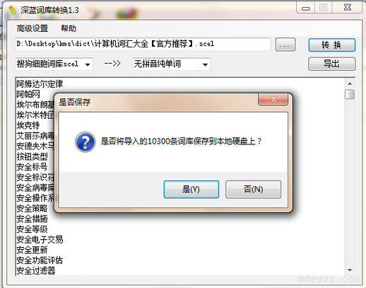

<!--
author: jockchou
date: 2015-08-26
title: coreseek中mmseg词库的导入方法
tags: coreseek, Sphinx，搜索引擎，mmseg
category: Sphinx
status: publish
summary: coreseek使用mmseg作为分词工具，默认的词库是有限的，我们需要为mmseg增加自定义词，用来丰富词库，实现更加精准的搜索服务。本文介绍如何自定义mmseg词，并通过脚本和mmseg命令导入词库。
-->

coreseek使用mmseg作为分词工具，默认的词库是有限的，我们需要为mmseg增加自定义词，用来丰富词库，实现更加精准的搜索服务。本文介绍如何自定义mmseg词，并通过脚本和mmseg命令导入词库。

##准备一个词库##

在导入之前，先准备好一个txt的词库文件，在这个文件中每个词占一行，保存为utf8编码格式，例如如下a.txt词库：

```
阿宝
阿爆
阿本
阿才
阿弟
阿弟仔
阿杜
阿朵
```

你也可以下载搜狗细胞词库，通过深蓝词库转换器转成以上的格式。


搜狗细胞词库下载地址：[http://pinyin.sogou.com/dict/][1]  
深蓝词库转换器下载地址：[imewlconverter_1_3_1][2]  

把搜狗细胞词库通过这个软件导出为txt文件，并且要把它转成utf8格式，默认是ANSI编码。

## 转成mmseg格式 ##

写脚本，将以上txt的词库转换成mmseg格式的txt。

```php
/*
* 把txt词库转换成mmseg词库
* 注意源文件必须是utf8编码
*/

$sourcefile = null;
$targetfile = null;

$options = getopt("s:o:");
if (!isset($options['s'])) {
    $sourcefile = "words.txt";
} else {
    $sourcefile = $options['s'];
}

if (!isset($options['o'])) {
    $targetfile = "mmseg-dict.txt";
} else {
    $targetfile = $options['o'];
}

convert_file($sourcefile, $targetfile);

function convert_file($sourcefile, $targetfile) {
    $rhandle = fopen($sourcefile, "r");
    $whandle = fopen($targetfile, "w");
    
    if ($rhandle) {
        while (($buffer = fgets($rhandle, 4096)) !== false) {
            $line = trim($buffer, "\r\n\t ");
            fwrite($whandle, "$line\t1\r\nx:1\r\n");
        }
        if (!feof($rhandle)) {
            echo "Error: unexpected fgets() fail\n";
        }
        fclose($rhandle);
        fclose($whandle);
    }
}
```

执行以上php脚本：
```
php words2mmseg.php -s a.txt -o b.txt
```
导出b.txt文件，它是mmseg词库要求的词式。

```
阿宝	1
x:1
阿爆	1
x:1
阿本	1
x:1
阿才	1
x:1
阿弟	1
x:1
阿弟仔	1
x:1
阿杜	1
x:1
阿朵	1
x:1
```

## 导入操作命令 ##
通过如下命令，将txt文件转成mmseg运行所需的lib词典：

```
cd /usr/local/mmseg3/etc/
cp unigram.txt unigram.txt.bk
cp uni.lib uni.lib.bk
cat b.txt >> unigram.txt
/usr/local/mmseg3/bin/mmseg -u /usr/local/mmseg3/etc/unigram.txt
mv unigram.txt.uni uni.lib
```

导入完成后，通过如下命令检验导入效果：
```
echo "阿弟仔" > whatever.txt
/usr/local/mmseg3/bin/mmseg -d /usr/local/mmseg3/etc/ whatever.txt
```

[1]:[http://pinyin.sogou.com/dict/]
[2]:[http://imewlconverter.googlecode.com/files/imewlconverter_1_3_1.zip]